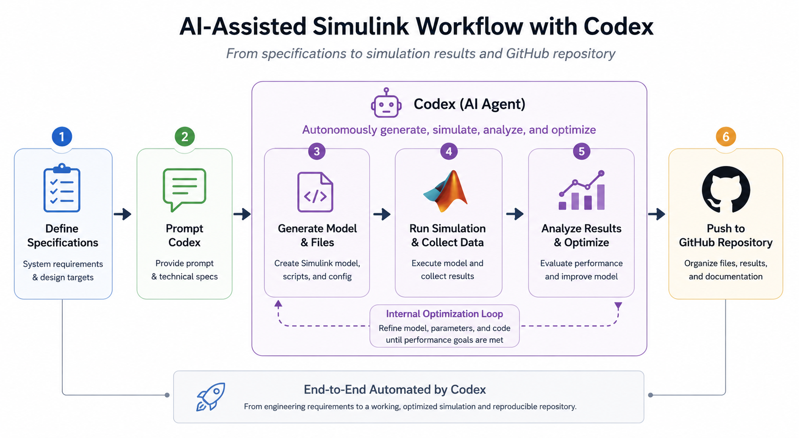
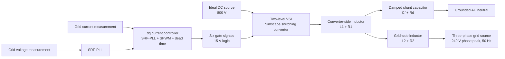
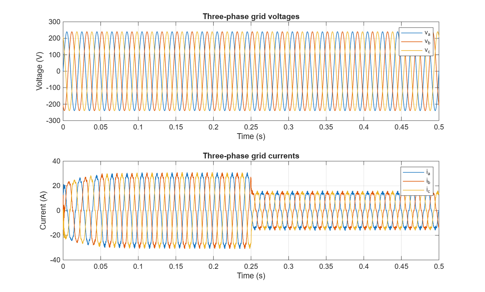
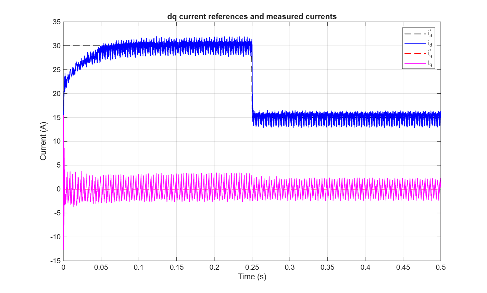
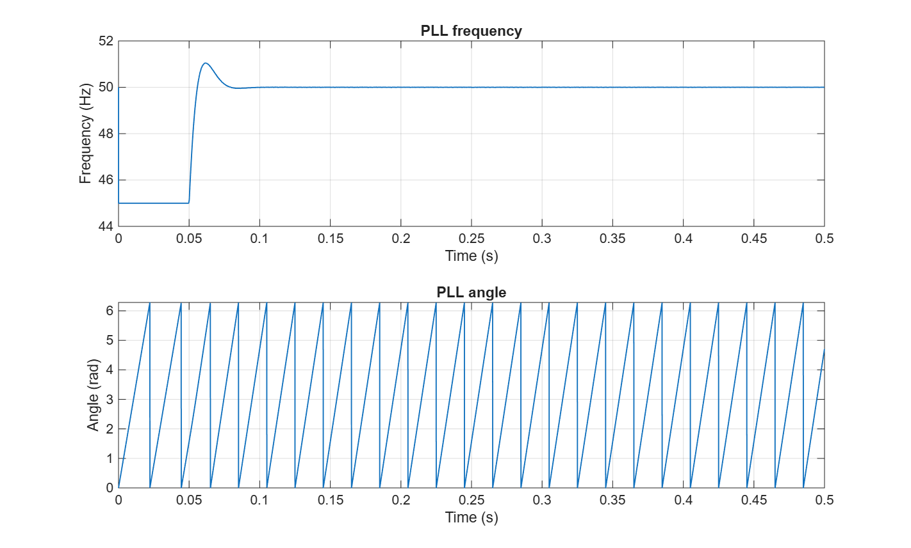
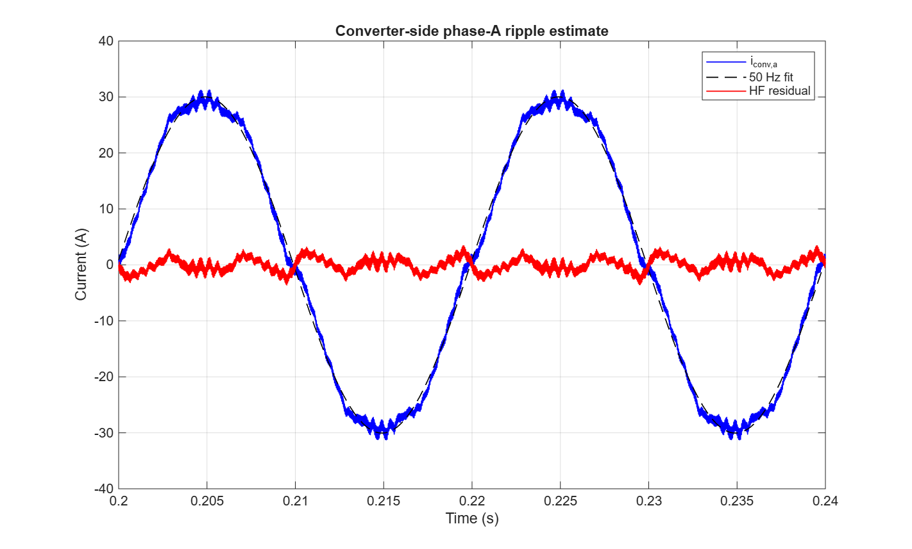
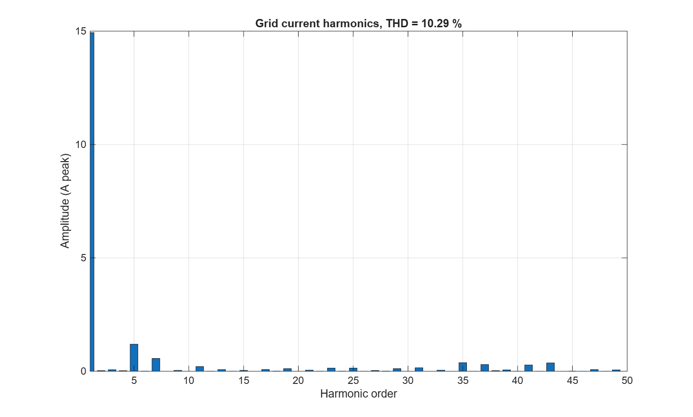
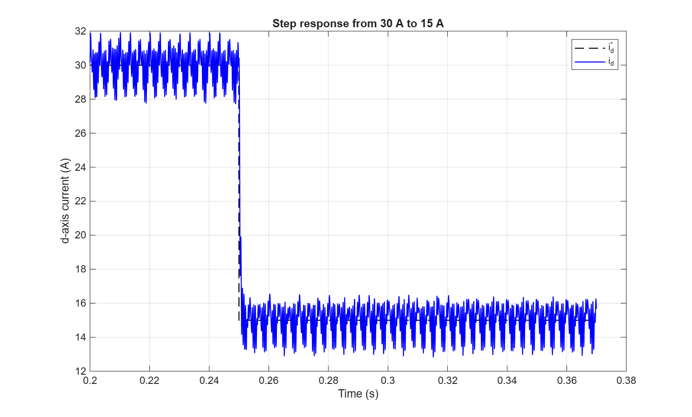

# AI Grid-Connected VSI Simulink

This repository is an experiment in an AI-assisted Simulink workflow with Codex: starting from engineering specifications, generating a switching Simscape Electrical model, running simulations, analyzing results, organizing documentation, and publishing a reproducible GitHub repository.



## Explanation Video

Here is the explanation video: [AI-assisted Simulink workflow with Codex on LinkedIn](https://www.linkedin.com/posts/zhengzhao-li_hi-everyone-ive-been-very-interested-in-ugcPost-7461694553729806336-NbIb?utm_source=share&utm_medium=member_desktop&rcm=ACoAAB-R8yQBlK2iXWPCQ5aWrjMYdMCgFc919-w)

Switching-level Simscape Electrical model of a three-phase grid-connected two-level voltage source inverter with an LCL output filter, SPWM modulation, dead time, SRF-PLL synchronization, and closed-loop dq current control.

The project is intended as a stable first-iteration engineering baseline rather than an aggressively optimized design. The inverter power stage is modeled as a detailed switching Simscape Electrical converter; the controller, PLL, SPWM, and dead-time logic are implemented as discrete Simulink/MATLAB control logic.

## Project Overview

The model represents a grid-connected DC-AC converter with:

- Three-phase two-level voltage source inverter
- Ideal 800 V DC source
- Detailed switching power stage, not an averaged inverter
- SPWM at 20 kHz
- 2 us complementary gate dead time
- LCL filter between inverter and grid
- Three-phase 50 Hz grid voltage source
- SRF-PLL for synchronization
- dq-frame current controller with a current reference step from 30 A to 15 A at 0.25 s

The baseline assumes the specified `VAC = 240 V` and `IAC_ref = 30 A` are phase peak amplitudes. The grid source is therefore configured with `Vline_rms = sqrt(3) * 240 / sqrt(2) = 293.9 V`.

## System Architecture



## Controller Structure

The controller is implemented in `scripts/grid_converter_control_sfun.m` as a discrete Level-2 MATLAB S-function. It runs with:

- Gate update sample time: `Ts_gate = 1 us`
- Current-control and PLL sample time: `Ts_ctrl = 50 us`
- Switching period: `Tsw = 50 us`

The control stages are:

1. Measure three-phase grid current and voltage.
2. Estimate grid angle and frequency with the SRF-PLL.
3. Transform measured grid current to the synchronous dq frame.
4. Apply dq PI current control with grid-voltage feed-forward and cross-coupling compensation.
5. Transform dq voltage commands back to abc modulation commands.
6. Generate SPWM gate commands with complementary dead time.

## LCL Filter Design

The first-pass LCL filter was selected to meet the converter-side ripple target while keeping the resonance well above the 50 Hz fundamental and below one tenth of the switching frequency.

| Parameter | Value |
| --- | ---: |
| Converter-side inductance `L1` | 2.0 mH |
| Converter-side resistance `R1` | 50 mOhm |
| Filter capacitance `Cf` | 10 uF |
| Passive damping resistance `Rd` | 2.72 Ohm |
| Grid-side inductance `L2` | 1.0 mH |
| Grid-side resistance `R2` | 50 mOhm |
| Estimated LCL resonance | 1.95 kHz |
| Estimated converter ripple | 2.50 A p-p |

The measured converter-side phase-A ripple from the switching simulation is `2.67 A p-p`, which is below the `3 A p-p` design target.

## PLL and dq Current Control

The SRF-PLL aligns the synchronous frame to the measured grid phase voltage. The baseline tuning uses a conservative PLL bandwidth of 30 Hz:

| PLL parameter | Value |
| --- | ---: |
| Bandwidth | 30 Hz |
| Damping ratio | 0.707 |
| `Kp` | 1.1106 |
| `Ki` | 148.044 |

The dq current loop controls grid-side current. The d-axis current reference steps from 30 A to 15 A at 0.25 s, while the q-axis reference is 0 A for unity-power-factor operation.

| Current-loop parameter | Value |
| --- | ---: |
| Bandwidth | 400 Hz |
| Equivalent inductance | 3.0 mH |
| Equivalent resistance | 0.10 Ohm |
| `Kp` | 7.5398 |
| `Ki` | 251.327 |

## Simulation Setup

The model was built and simulated with MATLAB/Simulink R2026a using Simscape Electrical.

| Setting | Value |
| --- | ---: |
| Stop time | 0.5 s |
| Solver | `ode23t` |
| Max step | 1 us |
| Switching frequency | 20 kHz |
| Dead time | 2 us |
| DC link | 800 V |
| Grid frequency | 50 Hz |
| Grid phase-voltage amplitude | 240 V peak |

## Key Results

The baseline 0.5 s switching simulation produced:

| Metric | Result |
| --- | ---: |
| Converter-side current ripple | 2.6735 A p-p |
| Grid current fundamental after step | 14.9343 A peak |
| Maximum h >= 2 harmonic amplitude | 1.1940 A peak |
| Harmonic amplitude limit | 1.5000 A peak |
| Grid current THD estimate | 10.2930% |
| Final d-axis current mean over last 50 ms | 15.0005 A |
| Final d-axis current standard deviation over last 50 ms | 0.8612 A |
| 2 ms moving-average 5% step settling estimate | 1.394 ms |

The raw 2% settling detector intentionally reports `NaN` because switching ripple keeps the unfiltered dq current outside that tight band. For switching converters, the moving-average settling result is the more useful first-pass dynamic metric.

### Grid Voltages and Currents



### dq Current Tracking



### PLL Frequency and Angle



### Converter-Side Ripple



### Grid Current Harmonic Spectrum



### Current Step Response



## How to Run

From MATLAB, open this repository as the working folder and run:

```matlab
run("scripts/inv_params_init.m")
run("scripts/design_lcl_filter.m")
run("scripts/tune_dq_pll_controllers.m")
run("scripts/build_three_phase_grid_converter_model.m")
run("scripts/run_simulation.m")
run("scripts/analyze_results.m")
```

The simulation script regenerates `docs/grid_converter_sim_results.mat`, and the analysis script regenerates the figures and `docs/grid_converter_analysis_report.txt`.

For a quick model rebuild without running the 0.5 s switching simulation:

```matlab
run("scripts/build_three_phase_grid_converter_model.m")
open_system("model/three_phase_grid_vsi_lcl.slx")
```

## Repository Structure

```text
.
|-- docs/
|   `-- grid_converter_analysis_report.txt
|-- figures/
|   |-- ai_assisted_simulink_workflow_codex.png
|   |-- converter_side_ripple.png
|   |-- current_step_response.png
|   |-- dq_current_tracking.png
|   |-- grid_abc_voltage_current.png
|   |-- grid_current_harmonics.png
|   `-- pll_frequency_angle.png
|-- model/
|   `-- three_phase_grid_vsi_lcl.slx
|-- scripts/
|   |-- analyze_results.m
|   |-- build_three_phase_grid_converter_model.m
|   |-- design_lcl_filter.m
|   |-- grid_converter_control_sfun.m
|   |-- inv_params_init.m
|   |-- run_simulation.m
|   `-- tune_dq_pll_controllers.m
|-- .gitignore
`-- README.md
```

## Notes

- The inverter power stage remains a detailed switching model.
- The controller implementation is discrete control logic and is not intended to be a switching-level physical controller model.
- The generated `.mat` simulation outputs and Simulink cache files are intentionally ignored by Git because they are reproducible and can become large.
